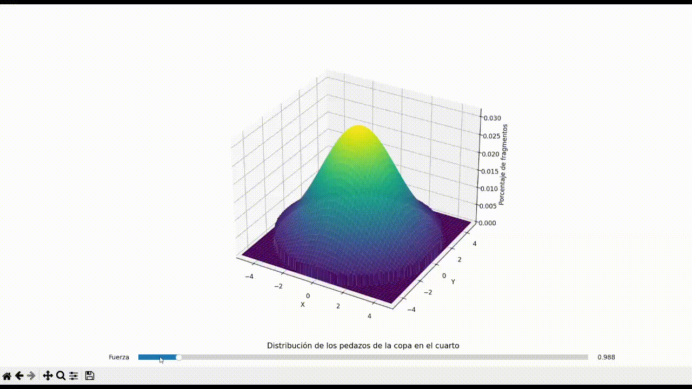

# Glass Break Distribution

## Abstract

The behavior of shattered glass fragments in a confined space, particularly in a circular room, has implications in safety protocols and accident forensics. This paper presents a computational model simulating the distribution of glass fragments resulting from a centrally-located impact in a circular room. By employing a bivariate normal distribution, the model varies the dispersion of fragments as a function of the applied force, illustrating a significant shift in the distribution pattern. The study aims to understand the correlation between the applied force and the area of spread, potentially serving as a reference for reconstructing events leading to similar breakage patterns.

## Introduction

Glass breakage is a common yet complex phenomenon with multiple variables affecting the resultant spread of fragments. Understanding this spread is critical in fields such as accident reconstruction, crime scene analysis, and safety testing. This research focuses on creating a simulated environment to examine how varying force affects the dispersion of glass fragments within a circular space. The purpose is to provide quantitative insights into the distribution patterns that emerge from different impact forces.

## Methodology

The model's foundation is a bivariate normal distribution, characterized by the probability density function (pdf):

$$
f(\mathbf{x}; \mu, \Sigma) = \frac{1}{2\pi|\Sigma|^{\frac{1}{2}}} \exp\left(-\frac{1}{2}(\mathbf{x} - \mu)^\top\Sigma^{-1}(\mathbf{x} - \mu)\right)
$$

where:

- $\mathbf{x} = (x, y)$ represents a point in the circular room,
- $\mu = (\mu_x, \mu_y)$ is the mean vector, corresponding to the impact's central location,
- $\Sigma$ is the covariance matrix, where $\Sigma = \begin{bmatrix}\sigma_x^2 & \rho\sigma_x\sigma_y \\ \rho\sigma_x\sigma_y & \sigma_y^2\end{bmatrix}$,
- $\sigma_x$ and $\sigma_y$ are the standard deviations of $x$ and $y$, respectively, and
- $\rho$ is the correlation coefficient, set to 0 for independence between $x$ and $y$.

The standard deviations are adjusted based on the force parameter, which is inversely proportional to the applied force, $F$, thus:

$$
\sigma_x = \sigma_y = \frac{D}{2F}
$$

where $D$ is the diameter of the room, ensuring that as the force increases, the dispersion of fragments becomes more widespread.

The simulated room is represented by a circular domain with radius $r = \frac{D}{2}$. To adhere to the physical boundaries of this space, we apply a mask to the distribution:

$$
Z(x, y) = \begin{cases} 
f(\mathbf{x}; \mu, \Sigma), & \text{if } x^2 + y^2 \leq r^2 \\
0, & \text{otherwise}
\end{cases}
$$

where $Z(x, y)$ represents the final adjusted probability density over the circular domain.

For visualization, we used a mesh grid with coordinates $(X, Y)$ spanning the room's diameter, and $Z$ values were computed using the masked distribution. This setup was implemented using Python with NumPy for numerical computations and Matplotlib for rendering the 3D surface plot. A Slider widget provided by Matplotlib facilitated the dynamic variation of the force parameter, allowing the observation of changes in real-time.

## Development

Initially, the simulation presented a uniform distribution of fragments, representing a low-impact scenario. As the force increased, the dispersion pattern transitioned from a high-density peak at the center to a flatter spread towards the room's periphery. The simulation revealed a non-linear relationship between force and dispersion area, with higher forces creating a more pronounced edge concentration of fragments.

## Conclusion

The simulation successfully illustrated how the force of impact affects the spread of glass fragments in a circular room. It demonstrated a clear transition from a centralized peak in fragment density to a more uniform distribution as force increased. This study provides a foundational understanding that can be applied in practical scenarios where glass breakage patterns are critical evidence. Future work could expand on this model by incorporating additional factors such as the angle of impact, glass properties, and environmental conditions.

